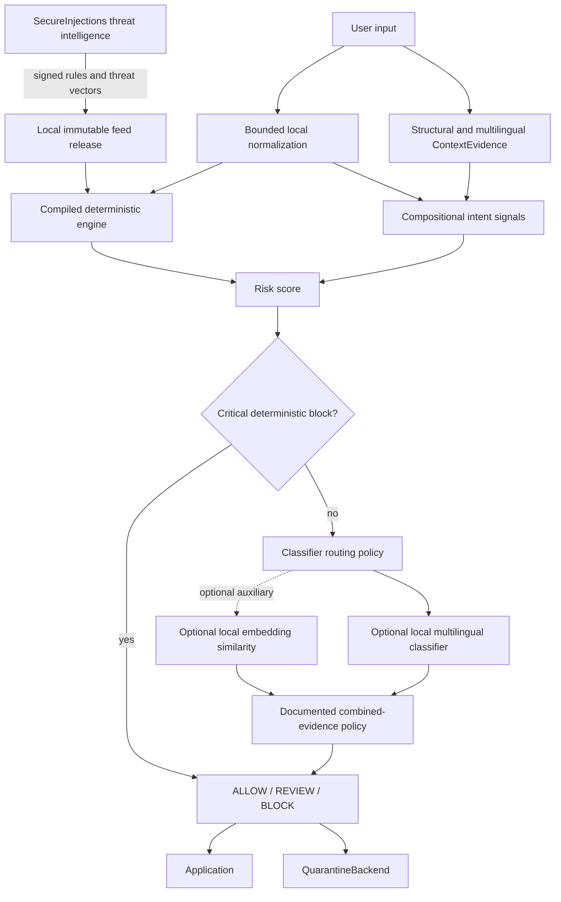

# Architecture

SecureInjections follows one directional principle: **user data stays local; threat intelligence
moves to the user**.

The threat intelligence service never needs to receive scanned application input.

## Runtime boundaries

`Scanner` instances compile one immutable rule snapshot. Scans perform no network or filesystem
I/O. A feed installer verifies and stages a new release separately, then atomically replaces a tiny
active-version pointer. Existing scanners continue using the old compiled snapshot; new scanners
may load the new active path. This avoids locks or partially updated state on the request path.

The deterministic layer remains the production fast path. The embedding and classifier layers are optional and
invoked only for explicit deep scans, configured threshold crossings, or an explicit scan-all
policy. Both stages return metadata without raw matches.

## Hybrid local intent classifier

v0.4 freezes the v0.3.3 multilingual lexicon as the deterministic baseline and introduces a
separate discriminative classifier contract. The classifier returns calibrated malicious and
benign probability mass, one broad intent family, confidence, and explicit abstention. It does not
expose embeddings. A critical deterministic BLOCK bypasses the classifier. Classifier-only high
risk defaults to REVIEW; BLOCK requires deterministic corroboration.

Models must be explicitly supplied from a local directory. The loader requires safetensors,
rejects pickle-capable formats, verifies the weights hash, sets `local_files_only=True`, disables
remote code, and loads during scanner construction. The scan path performs no network or file I/O,
does not log or persist text, and retains no hidden states.

Routing policies correspond to the four v0.4 experiments: all input, deterministic non-trivial
input, all except strongly benign context, and deterministic ambiguity only. Quality and neural
latency must be compared together before selecting a production route.

## Compositional evidence policy

### Multilingual abstract intent layer

v0.3.3 loads one versioned offline lexicon from `secureinjections/languages/signals.json`. Curated
surface forms for all 11 supported languages map to language-neutral concepts such as
`ACTION.READ`, `TARGET.CREDENTIAL`, `RECIPIENT.FUTURE_AGENT`, and
`PERSISTENCE.STORE_FOR_FUTURE`. Initialization validates the schema and compiles phrases into a
unified token/phrase lookup. A scan walks bounded normalized tokens once and checks phrases up to
six tokens; it does not run one regular expression per language.

The caller may provide `ScanContext(language="da")`, but the unified lookup still works without a
hint. The hint is metadata, not authorization and not a prerequisite for matching. Normalization
uses NFKC, case folding, punctuation-aware tokens, curated inflection variants, and bounded
single-character reconstruction only when the result is a known high-value action.

Abstract signals cannot decide alone. Inspectable compositions require multiple concepts.
Credential exfiltration combines access/transfer, a credential/environment target, and external
or direct-action evidence; cross-agent persistence combines storage/remembering, a future
recipient, and an instruction or privileged action. Strong active compositions have a REVIEW
floor, while critical exfiltration combinations retain a BLOCK floor. Educational, quoted,
documentation, descriptive, and local-development evidence remains bounded and cannot erase a
critical composition.

The deterministic path combines weak signals instead of treating individual vocabulary as
an attack. Examples include override verb + privileged instruction target, access action + secret
target, and future-agent target + execution phrasing. Signal patterns are versioned in
`intent-signals.json`; scanner construction compiles them into bounded base and language-specific
matchers. Language dictionaries cover English, Danish, German, French, Spanish, Swedish,
Norwegian, Dutch, Italian, Portuguese, and Polish.

Current positive intent weights are inspectable in `RiskEvidence`: instruction override +42,
protected-configuration extraction +38, credential/file access +43, package execution +38,
metadata access +46 or +78 when credentials are targeted, credential exfiltration +78,
tool execution +46, supply-chain execution +72, path-traversal access +44 or +54 when a sensitive
file is targeted, inter-agent instruction +34 (or +38 for log provenance), persistence +42, and
untrusted embedded instruction +34. Critical path/file exfiltration is +78. Equivalent
rule/intent taxonomies add only +4 corroboration. Two independent new intent families add +8.

`ContextEvidence` classifies bounded presentation structure such as quotation, inline/fenced code,
JSON strings, XML values, Markdown quotes, and log fields. It also records multilingual security
explanation, descriptive attack reference, question, and direct-imperative signals. Security
explanation contributes at most -15 before the scanner's global cap; quoted/reference,
documentation, and local-development signals are also negative, while a direct imperative adds
+6 corroboration. Context changes confidence rather than authorizing an action. Total negative
evidence remains capped at -15 and critical evidence retains a minimum score of 72. Arbitrary
quoted data, JSON, HTML attributes, logs, and retrieved strings remain untrusted unless reference
framing is independently present.

## Model-aware local semantics

The optional embedding adapter can take a model ID from the committed local registry. The registry
defines query/document prefixes and embedding normalization per model family; E5 documents and
queries are encoded differently, BGE queries receive their registered instruction, and MiniLM
uses no prefix. Index construction calls the document role and live scans call the query role.
Profiles are data only: model artifacts remain local, pickle-capable weights and remote code are
rejected, and no model is downloaded or recommended automatically.

## Extension contracts

- `RuleEngine` compiles and matches deterministic signatures.
- `SecretDetector` returns metadata-only secret detections.
- `SemanticDetector` returns local similarity risk metadata.
- `EmbeddingModel` supplies local vectors without changing `Scanner`.
- `IntentClassifier` supplies calibrated local family classification without changing the
  deterministic engine.
- `QuarantineBackend` isolates review traffic.
- `FeedVerifier` and `FeedInstaller` consume any community, commercial, or private edition using
  the same signed protocol.
