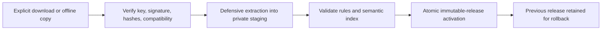

# Signed threat-intelligence feeds

A feed is a ZIP bundle with:

```text
manifest.json
signature.ed25519
artifacts/rules.zip
artifacts/semantic-index.zip  # optional
```

The canonical manifest identifies the feed/schema/rules/index versions, edition, creation time,
minimum engine version, SHA-256 artifact hashes, and exact signing key ID. Ed25519 is provided by
the widely used `cryptography` package; SecureInjections does not implement custom cryptography.

## Administrative flow



There is no reverse arrow carrying scanner input. `scan()` cannot trigger an update. A future
explicit HTTPS updater can download bundles, but it must feed the same verifier and installer.

## Defensive installation

The client rejects unsigned or incorrectly signed manifests, unknown key IDs, artifact mismatches,
engine incompatibility, downgrades, duplicate versions, oversized archives, excessive compression
ratios, duplicate members, absolute/traversal paths, backslashes, NULs, and symlinks. It extracts
only into a newly created private staging directory, validates before rename, and never edits an
active rule directory in place.

The public keyring is an administrative trust root. Distribute it separately, pin expected key IDs,
protect feed-root permissions, and define a documented key-rotation process. Rollback is an explicit
local administrative operation and does not bypass signature verification of the original release.

## Building and installing offline

```bash
python tools/sign_feed.py \
  --key-id community-2026 \
  --private-key community-private.key \
  --keyring community-keyring.json

python tools/build_feed.py \
  --rules secureinjections-rules/rules \
  --output community-1.0.0.bundle \
  --feed-version 1.0.0 \
  --rules-version 1.0.0 \
  --key-id community-2026 \
  --private-key community-private.key

secureinjections feed verify community-1.0.0.bundle --keyring community-keyring.json
secureinjections feed install community-1.0.0.bundle \
  --keyring community-keyring.json --root /opt/secureinjections/feed
```

Pin a scanner to the active immutable release at construction time:

```python
from pathlib import Path

from secureinjections import Scanner
from secureinjections.threatintel import FeedInstaller, FeedVerifier

installer = FeedInstaller(
    Path("/opt/secureinjections/feed"),
    FeedVerifier(Path("community-keyring.json")),
)
scanner = Scanner(installer.scanner_config())
```

Protect and preferably isolate the private signing seed. Only the public keyring belongs on clients.
Install both optional extras when a feed contains a semantic index:
`pip install 'secureinjections[feed,semantic]'`.
